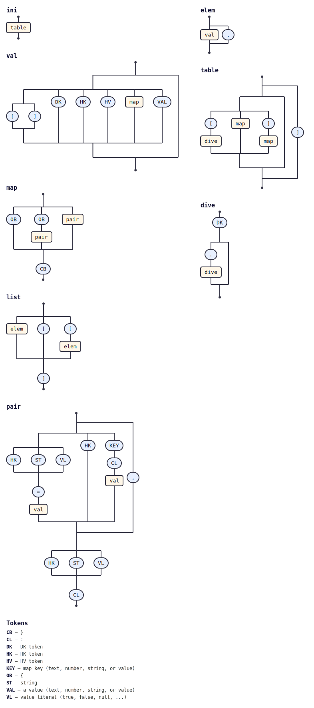

# @tabnas/ini

<!-- tabnas-badges -->
[](https://www.npmjs.com/package/@tabnas/ini)
[](https://github.com/tabnas/ini/actions/workflows/ci.yml)
[](https://pkg.go.dev/github.com/tabnas/ini/go)
[](https://tabnas.github.io/status/)
<!-- /tabnas-badges -->

A [jsonic](https://github.com/tabnas/jsonic) syntax plugin that parses
[INI](https://en.wikipedia.org/wiki/INI_file) files into objects / maps
— with sections, dot-nested keys, `[]` arrays, multiline values, and
inline comments. Available for both TypeScript and Go.

It is a plugin on the [tabnas](https://github.com/tabnas/parser) engine:
the grammar is declarative data, the same for both language ports.

## Install

```bash
# TypeScript / JavaScript
npm install @tabnas/ini @tabnas/parser @tabnas/jsonic @tabnas/hoover

# Go
go get github.com/tabnas/ini/go@latest
```

## Example

**TypeScript**

```js
import { Tabnas } from '@tabnas/parser'
import { jsonic } from '@tabnas/jsonic'
import { Ini } from '@tabnas/ini'

const j = new Tabnas().use(jsonic).use(Ini)

j.parse('[server]\nhost = localhost\nport = 5432\ntags[] = a\ntags[] = b')
// => { server: { host: 'localhost', port: '5432', tags: ['a', 'b'] } }
```

**Go**

```go
result, _ := tabnasini.Parse("[server]\nhost = localhost\nport = 5432\ntags[] = a\ntags[] = b")
// map[string]any{"server": map[string]any{
//   "host": "localhost", "port": "5432", "tags": []any{"a", "b"}}}
```

INI values are strings by default; the keywords `true`/`false`/`null`
resolve to their host types.

## Documentation

Four-quadrant docs per language:

| | TypeScript | Go |
|---|---|---|
| Tutorial (learn) | [ts/doc/tutorial.md](ts/doc/tutorial.md) | [go/doc/tutorial.md](go/doc/tutorial.md) |
| How-to guide (recipes) | [ts/doc/guide.md](ts/doc/guide.md) | [go/doc/guide.md](go/doc/guide.md) |
| Reference (API, options, syntax) | [ts/doc/reference.md](ts/doc/reference.md) | [go/doc/reference.md](go/doc/reference.md) |
| Concepts (how it works) | [ts/doc/concepts.md](ts/doc/concepts.md) | [go/doc/concepts.md](go/doc/concepts.md) |

The Go [concepts](go/doc/concepts.md#differences-from-the-ts-version)
also covers how the Go port differs from TypeScript.

This repository contains:

| Path | Description |
|---|---|
| [`ts/`](ts/) | TypeScript / JavaScript implementation (`@tabnas/ini`). |
| [`go/`](go/) | Go port (`github.com/tabnas/ini/go`). |
| [`test/spec/`](test/spec/) | Shared `.tsv` conformance fixtures, exercised by both runtimes. |

## Grammar

The grammar is defined once in the top-level
[`ini-grammar.jsonic`](ini-grammar.jsonic) and embedded into both
implementations — TypeScript ([`ts/src/ini.ts`](ts/src/ini.ts)) and Go
([`go/ini.go`](go/ini.go)) — by [`ts/embed-grammar.js`](ts/embed-grammar.js)
(run as part of `npm run build`). Edit the `.jsonic` file, never the
embedded copies.

The installed grammar as a railroad/syntax diagram, generated from the
live grammar with [`@tabnas/railroad`](https://github.com/tabnas/railroad):



ASCII version: [`ts/doc/grammar.txt`](ts/doc/grammar.txt).

## License

MIT. Copyright (c) Richard Rodger and other contributors.
